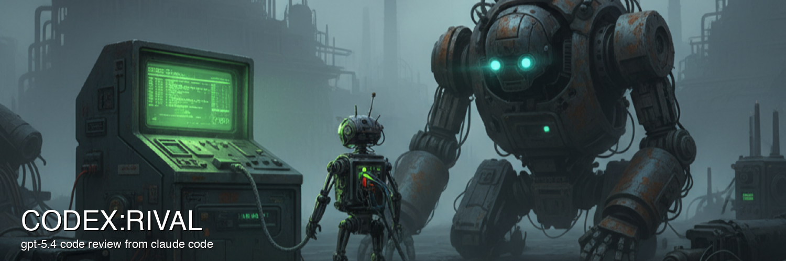

# rival



## TLDR

**Why this exists.** A coding agent reviewing its own work keeps its own
assumptions. It wrote the bug, so it reads the code the same way twice. Rival
asks a different model, in a separate process with its own context, to read
the repository and report back. You get a second opinion that has not already
agreed with you.

**1. Install**

```bash
brew install 1F47E/tap/rival
rival install          # Claude skills + Codex skills when Codex is detected
```

Then set up at least one model. Sol is the usual first one:

```bash
npm install -g @openai/codex && codex login
```

**2. Use it from Codex or Claude Code**

In Codex, use `$rival-fable` to get a Fable 5.1 review of your changes:

```text
$rival-fable
$rival-fable src/api/
$rival-fable -re high src/api/
```

Install and authenticate the Claude Code CLI (`claude auth login`) for Fable.
Codex launches Rival, waits with progress updates, and presents the result in
the same turn. All eleven skills are available with `$rival-...` names.

In Claude Code:

```
/rival-review              review your changes with an independent model
/rival-security            hunt vulnerabilities, not style
/rival-antislop            find over-engineering and AI slop
/rival-plan plan.md        rate a plan before you build it
```

Each runs in the background and reports when done, so your session keeps
moving. `/rival-review` with no arguments reviews whatever you have changed.

## Skills

Installed by `rival install`: slash commands in Claude Code and `$rival-...`
skills in Codex. Both launch detached runs. Claude Code uses a background
watcher; Codex keeps the turn active and waits for the result.

| Skill | What it does | Why it's useful |
|-------|--------------|-----------------|
| `/rival-review` | Sol reviews your changes; add `-m k3` for a second reviewer that hunts vulnerabilities, and a consilium judge merges both | The default review gate. One independent model with full repo access, or two with different lenses |
| `/rival-security` | Dedicated security review: injection, authorization and IDOR, crypto, SSRF, traversal, deserialization, secrets, CSRF, and more | Bug reviews barely touch security. This one hunts exploitable vulnerabilities and refuses to run rather than skip silently |
| `/rival-antislop` | Quality-only review of changed code: over-engineering, reinvented libraries, compat hoarding, AI-slop patterns. Returns a leanness rating (1-10) and a cut list | Bug reviews can't tell you the code shouldn't exist. This one names what to delete, merge, or replace — the counterweight to AI-generated bloat |
| `/rival-plan` | Sol + Fable independently rate a plan/spec 1-10 and list bugs, gaps, and ambiguities (xhigh effort) | Catches wrong steps and missing pieces in a design while they're still words, with two models' blind spots covering each other |
| `/rival-plan-sol` / `/rival-plan-fable` | Single-model plan review | When you want one specific second opinion — Sol for independence from a Claude-based session, Fable when Sol is unavailable |
| `/rival-sol` | Any prompt, or `review [scope]`, via Sol (OpenAI Codex CLI) | An independent non-Anthropic perspective with read-only repo access — ask it anything or point it at a diff |
| `/rival-astra` | The same single-model run on Astra (`gpt-6-astra`), Sol's deep-reasoning sibling on the same runtime | Reach for it when Sol's pass feels shallow — it defaults to xhigh effort |
| `/rival-fable` | Code review of changed files via Fable (Claude Code CLI) | A separate Claude reviewer whose exploration stays out of your session's context |
| `/rival-k3` | Any prompt via Kimi K3 (max reasoning, OpenCode) | A cheap opinion from a thinking-only model on a different provider |
| `/rival-grok` | Any prompt, or `review [scope]`, via Grok (xAI CLI); opt-in only | Never in the default roster; there when you explicitly want the fourth opinion |

All accept `-re <effort>` (`low`/`medium`/`high`/`xhigh`) and, where a roster
applies, `-m <model[,model]>`.

## Install

```bash
brew install 1F47E/tap/rival
rival install          # Claude + detected Codex
rival install --target codex  # explicit Codex install, even without auto-detection
```

From source: `cd rival && make install && rival install` (the Go module lives
in the `rival/` subdirectory, so remote `go install` is not supported).

Skills go to `~/.claude/skills` for Claude and `~/.agents/skills` for Codex.
`--target auto` (default) preserves Claude installation and adds Codex when its
CLI, `~/.codex`/`CODEX_HOME` directory, or macOS app is present. `--target claude`,
`codex`, or `all` overrides detection. `CODEX_HOME` is a detection signal; the
Codex skill destination remains the documented user directory, `~/.agents/skills`.

Upgrade with `rival update` (equivalent: `brew upgrade 1F47E/tap/rival &&
rival install --force`). It installs skills using the upgraded binary and also
refreshes skills when the binary is already current, including for a newly
installed Codex. Restart or reload the host if refreshed skills do not appear.
To refresh only Codex, use `rival install --target codex --force`.

### Provider setup

You only need the runtimes for the models you use; an unavailable model is
skipped, not fatal.

- **Sol** — [Codex CLI](https://github.com/openai/codex):
  `npm install -g @openai/codex && codex login` (browser ChatGPT login
  preferred; `codex login --with-api-key` for usage-based billing). Do not put
  the OpenAI key in the reviewed repository — Rival only needs the Codex login.
- **Kimi K3** — [OpenCode](https://opencode.ai/docs)
  (`curl -fsSL https://opencode.ai/install | bash` or
  `brew install anomalyco/tap/opencode`) plus a
  [Kimi API key](https://platform.kimi.ai/console/api-keys) in
  `MOONSHOT_API_KEY` (project `.env` or shell export; keep `.env` gitignored).
- **Fable 5.1** — the [Claude Code](https://code.claude.com/docs/en/overview)
  CLI, authenticated with `claude auth login` or `/login`, even when Codex is
  the host. Review restrictions were verified with Claude Code 2.1.263; update
  the CLI if it rejects `--safe-mode` or another review flag. See
  [Fable auth](#fable-auth) for subscription-vs-API billing.
- **Grok** (optional) — [Grok CLI](https://docs.x.ai/) with `grok login`
  (browser OAuth; `XAI_API_KEY` is deliberately unsupported — Rival blocks the
  `GROK_`/`XAI_` env prefixes so a reviewed repo's `.env` cannot re-point the
  runtime).

## Usage

### Reviews

```
/rival-review                              — Sol; auto-detect changed files
/rival-review -m sol,k3 src/api/           — add the security lens
/rival-review -re xhigh src/api/           — override effort
/rival-sol review                          — single-model review
/rival-fable                               — Fable review of changed files
/rival-k3 review src/api/
/rival-grok review src/api/                — opt-in
```

Fable code, plan, and antislop reviews expose only Read, Glob, and Grep.
Shell execution, edits, MCP tools, and user/project hooks and plugins are disabled;
the Docker transport additionally mounts the repository read-only. Fable can
read source and follow imports, but cannot run tests or git commands itself.
Rival performs git scope detection before starting the reviewer. These are CLI
tool restrictions, not an OS sandbox for the native Claude process. Raw Fable
prompts retain their existing full-auto behavior.

Scope auto-detection via git: dirty files first, else last commit, else the
full project. The scope is a focus hint, not a restriction — reviewers have
mechanical read-only access to the whole repo and follow imports as needed, so
natural-language scopes work: `/rival-sol review the authentication middleware`.

Raw prompts (`/rival-sol explain the auth flow`) run full-auto in the workdir;
rival strips known credential env vars from the child as blast-radius
reduction. Grok's `review` additionally passes `--sandbox read-only`, but its
built-in profiles fail open without a kernel sandbox and keep temp dirs
writable — treat it accordingly.

### Security

```
/rival-security                             — vulnerabilities in the changed files
/rival-security src/api/                    — a specific scope
rival command security --which              — which model will run, and can it
```

The model comes from `~/.rival/config.yaml`, so the skill never hardcodes one:

```yaml
security:
  reviewer: k3      # or grok — k3 is the default
```

`k3` runs Kimi K3 through OpenCode on Moonshot (`MOONSHOT_API_KEY`); `grok`
runs Grok 4.6 through OpenCode on OpenRouter (`OPENROUTER_API_KEY`). The run
fails if the chosen model has no key rather than falling back, because a
security review that quietly skips is worse than one that refuses to start.
Output that does not parse is reported as unusable, never as a clean review.

`-m k3` in a megareview carries the same security lens, so `-m sol,k3` gives
you one reviewer hunting bugs and one hunting vulnerabilities. The judge is
told which reviewer used which lens, so a finding only the security reviewer
could have made is not discounted for lacking a second vote.

### Antislop

```
/rival-antislop                             — cut list for the changed files (auto-detect)
/rival-antislop src/api/                    — cut list for a specific scope
/rival-antislop -m fable src/               — with Fable instead of Sol
```

Every other rival command hunts bugs. Antislop hunts the opposite failure
mode: code (or a plan) that *works* but shouldn't exist in that shape. Angles:
reuse/DRY, simplification, efficiency, altitude (fixes at the wrong depth),
backward-compat hoarding, library reinvention, and AI-slop signatures (comment
slop, silent fallbacks, pass-through wrappers, speculative generality; scope
speculative generality). Default model **sol**, default effort **xhigh**.
Report-only: it proposes, your session applies. Native form:
`rival command antislop`, where `--` takes a scope verbatim.

### Plan review

```
/rival-plan path/to/plan.md                 — Sol + Fable at xhigh
/rival-plan-sol path/to/plan.md             — Sol only, xhigh
/rival-plan-fable path/to/plan.md           — Fable only (configured effort, low fallback)
```

Each model rates the plan 1-10 and returns numbered findings (bugs, gaps,
ambiguity, scope, verification). Native:
`rival command plan --model sol --effort xhigh`.

### Model selection & effort

`-m/--model`: `sol`, `k3`, `grok` for code reviews; `sol`, `fable` for plan
and antislop commands. An explicit list replaces the roster — naming `grok` is
the only way it joins a review. `-re/--effort`: `low`/`medium`/`high`/`xhigh`.

Per-model defaults live in `~/.rival/config.yaml`:

```yaml
efforts:
  sol: high
  kimi-k3: max
  fable: medium
  grok: high
```

Precedence: explicit `-re`/`--effort` → configured model value → the command's
built-in fallback. K3 is fixed at `max` (its only level). Grok exposes only
low/medium/high, so wider values clamp to `high` and the clamped value is what
sessions record. Skill-pinned efforts (plan skills at xhigh) win over the
config file.

### Roles & consilium (megareview)

`/rival-review` assigns each reviewer the bug-hunter role (custom role prompts
via `roles:` in `~/.rival/config.yaml`), collects structured JSON findings
(file, line, severity, category, confidence, fix), then runs a consilium pass
with the highest-priority successful model: merges duplicates (all reporters
in `found_by`), +2 confidence when 2+ reviewers agree, filters below
confidence 6, and produces `approve` / `request_changes` / `comment`. A
reviewer that hits a provider quota is reported as **skipped** with the
reason, never counted as a clean empty review.

```
═══ RIVAL REVIEW ═══

Summary: ...

[CRITICAL] file.go:42 — Title
  Description...
  Fix: ...
  Found by: sol, kimi-k3

Recommendation: request_changes — ...

Reviewed by: sol (bug_hunter), kimi-k3 (bug_hunter)
Judge: sol (consilium)
Findings: 5 (threshold: 6)
```

### Terminal CLI

```bash
echo 'explain the auth flow' | rival run sol --prompt-stdin --workdir .
rival review src/api/                        # default two-model roster
rival review --model sol src/api/
echo 'docs/plan.md' | rival command plan --workdir .
echo 'the entire project' | rival command antislop --workdir .
```

### TUI & web dashboards

```bash
rival tui                 # full-screen session monitor
rival server --port 3333  # localhost-only web dashboard
```

The TUI lists sessions with status, model, effort, and elapsed time, grouping
multi-model runs into one row; `Enter` opens a detail view with the
live-streaming log, `x` kills a stuck session, `o` opens the combined log. The
web dashboard shows the same grouping with pagination, per-member status,
queue position, and a bounded live log tail.

### Sessions & queue

```bash
rival sessions              # all sessions as a text table
rival queue                 # tickets: position, state, wait
rival queue clear           # remove dead tickets
```

Multiple sessions invoke rival as independent processes; a **cross-process
FIFO queue** (ticket files + `flock` in `~/.rival/queue/`, no daemon) keeps
concurrent reviews at `RIVAL_MAX_CONCURRENT` (default 2). Waiting runs print
`rival queue: position 2/3 …` and appear as `◌ queued` in the dashboards. A
crashed slot-holder is reaped automatically.

| Var | Default | Effect |
|-----|---------|--------|
| `RIVAL_MAX_CONCURRENT` | `2` | Reviews running at once |
| `RIVAL_QUEUE_TIMEOUT` | `30m` | Max wait for a slot |
| `RIVAL_RUN_TIMEOUT` | `30m` | Max run once a slot is held (`0` disables); megareview gets 2× for its two phases |
| `RIVAL_NO_QUEUE` | unset | Bypass the queue (also `--no-queue`; use on NFS homes where `flock` is unreliable) |

**`--detach`** re-execs rival into its own process session and returns
immediately — the run survives the launching shell's teardown. **`rival wait
--log <stderr-file>`** blocks until the detached run finishes (exit codes: 0
completed · 2 failed · 3 crashed · 4 timed out); Claude skills arm it as a
background watcher; Codex skills wait through a resumable shell session and
present the result before ending the turn.

## Architecture

```
Host coding session
    │
    │ /rival-review
    ▼
Slash-command skill (async — does not block the session)
    │ 1. prompt tempfile → rival command megareview --detach --workdir $(pwd)
    │ 2. arm background watcher:  rival wait --log <err>
    │ 3. hand back to the session and END the turn
    ▼
rival binary (own process session — survives the skill teardown)
    ├─ parses model selection (-m), effort (-re), and review scope
    ├─ waits for a queue slot, bounds the run by RIVAL_RUN_TIMEOUT
    ├─ spawns the selected models as separate subprocesses
    └─ writes session JSON + live log to ~/.rival/sessions/
         │
         ▼  (rival exits → background `rival wait` exits → harness wakes session)
    The host reads the output file and presents the review verbatim

Megareview: shared GroupID → concurrent role-prompted reviewers → skip 429s →
parse structured JSON → highest-priority survivor judges the consilium →
unified verdict. TUI/web group sessions by GroupID.
```

Key decisions: reviewers get real read-only repo access, not pasted diffs;
runs are detached, with host-specific waiting; stdin goes through safely written
tempfiles; child env is sanitized; a failed reviewer never
kills the run; unparseable reviewer output reaches the judge as a stub with a
2KB debug tail instead of overflowing the prompt.

## Fable auth

Fable runs through the authenticated Claude Code CLI and bills your
**subscription login** by default — an exported `ANTHROPIC_API_KEY` is
stripped from the child env so the CLI can't silently switch to API billing.

| `RIVAL_CLAUDE_AUTH` | Behavior |
|---------------------|----------|
| unset / `subscription` / `sub` | Use the CLI's `/login` auth; `ANTHROPIC_API_KEY` / `ANTHROPIC_AUTH_TOKEN` stripped |
| `api` | Bill the API key; requires `ANTHROPIC_API_KEY`, hard error if empty |
| anything else | Hard error — auth is never guessed |

Optional `~/.rival/config.yaml`:

```yaml
claude:
  subscription: team    # or "personal" — shown in the TUI Account field
```

The active mode is logged per run and shown in the TUI. On auth failures rival
appends an actionable hint (not logged in → run `claude` and `/login`).

## Models

| Model | Default effort | Used by |
|-------|----------------|---------|
| Sol | high (code review); xhigh pinned in plan skills, xhigh antislop fallback | `/rival-review`, `/rival-sol`, `/rival-plan`, `/rival-plan-sol`, `/rival-antislop` |
| Fable | medium (code review); plan low fallback; xhigh antislop fallback | `/rival-fable`, `/rival-plan`, `/rival-plan-fable`, antislop with `-m fable` |
| Kimi K3 | max (only level the provider supports) | `/rival-k3`, `/rival-review` |
| Grok | high (clamped ladder) | `/rival-grok`, reviews with `-m grok` |

## Uninstall

```bash
rm -rf ~/.claude/skills/rival-*
rm -rf ~/.agents/skills/rival-*
brew uninstall rival        # if installed via brew
# source install: rm "$(go env GOBIN 2>/dev/null || echo "$(go env GOPATH)/bin")/rival"
```

## License

MIT
